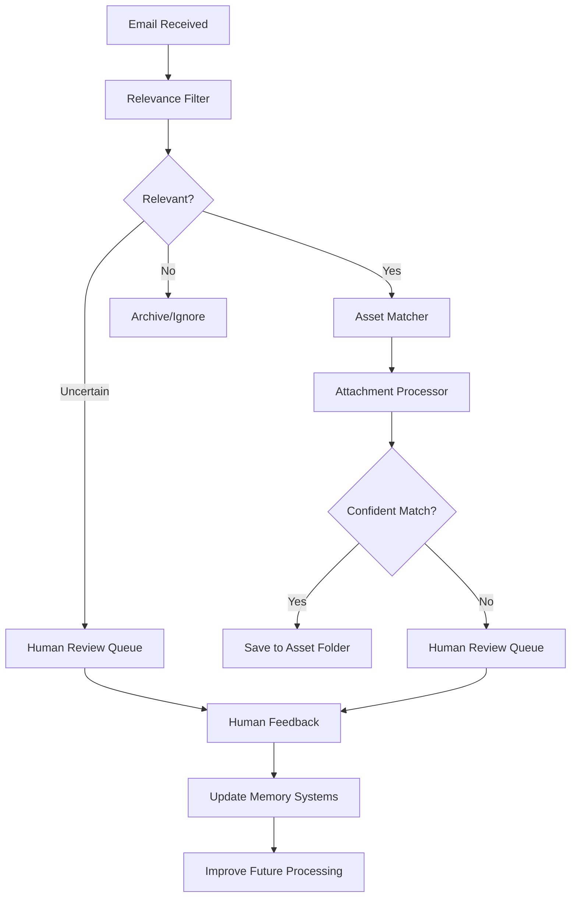

# Email Agent - AI-Powered Investment Document Processing System

> **A developer guide for this email processing system**

## 📋 Table of Contents

1. [🎯 Project Overview](#-project-overview)
2. [🏗️ Architecture Deep Dive](#️-architecture-deep-dive)
3. [🧩 Core Components Explained](#-core-components-explained)
4. [🧠 Memory System Architecture](#-memory-system-architecture)
5. [⚡ Email Processing Workflow](#-email-processing-workflow)
6. [🚀 Setup and Installation](#-setup-and-installation)
7. [💻 Development Workflow](#-development-workflow)
8. [⚙️ Configuration Guide](#️-configuration-guide)
9. [📧 Email System Integration](#-email-system-integration)
10. [🔍 Understanding the Codebase](#-understanding-the-codebase)
11. [🛠️ Troubleshooting Guide](#️-troubleshooting-guide)
12. [🔬 Advanced Topics](#-advanced-topics)
13. [📊 Production Monitoring](#-production-monitoring)
14. [🤝 Contributing Guidelines](#-contributing-guidelines)

---

## 🎯 Project Overview

### What is Email Agent?

Email Agent is an **AI-powered document processing system** designed for **investment management firms**. It processes incoming emails, extracts and classifies attachments, matches them to specific investment assets, and organizes them into structured directory hierarchies.

### Current Status

The system is operational with these features:

| Feature | Status | Confidence | Details |
|---------|--------|------------|---------|
| **Relevance Detection** | Working | 0.8+ | Memory-driven rules with reasoning output |
| **Asset Matching** | Working | 0.247+ | Confidence scoring implemented |
| **File Organization** | Working | Variable | Automatic `/assets/ASSET_ID/filename.ext` structure |
| **Multi-Email Support** | Working | Variable | Gmail + Microsoft 365/Outlook integration |
| **Human Learning** | Working | Variable | Feedback integration with memory updates |

### Business Problem

**Problem**: Investment firms receive many emails daily with critical documents requiring manual sorting:
- Financial statements, rent rolls, loan modifications
- Legal agreements, compliance reports
- Investment memos, due diligence packages
- Manual document organization time burden

**Solution**: Automated processing approach:
- Automated processing reduces manual work
- Low-confidence items flagged for human review
- System learns from human feedback
- Audit trail for all decisions
- Virus scanning and access controls

### Test Cases

```bash
Single Email: "i3 loan docs" with RLV_TRM_i3_TD.pdf
   Relevance: 0.8 → Asset Match: I3_VERTICALS_CREDIT (0.247) → File Saved

Multi-Email Batch: 4 attachments with different asset matches
   Files matched and saved to appropriate directories

Human Review Integration: Low-confidence items → Review queue → Feedback → Learning
```

---

## 🏗️ Architecture Deep Dive

### 📐 Core Design Philosophy

This system is built on **three design principles**:

#### 1. 🧠 **Memory-Driven Architecture** (Not Rule-Based)
```
Previous approach: Hardcoded business logic
if email.subject.contains("investment"):
    return "relevant"

Current approach: Memory-driven decisions
relevance_rules = procedural_memory.get_relevance_rules()
confidence = apply_rules(email, relevance_rules)
```

**Rationale**: Business rules change frequently in investment firms. Memory-driven architecture allows rule updates without code deployment.

#### 2. ⚡ **Attachment-Centric Processing** (Not Email-Centric)
```
Previous approach: Process email → Route entire email
Current approach: Process email → Route each attachment independently
```

**Rationale**: One email might contain documents for multiple assets (common in investment communications).

#### 3. 🔍 **Transparent Decision Making** (Not Black Box)
Every decision includes reasoning:
```python
{
  "decision": "match_to_I3_VERTICALS",
  "confidence": 0.847,
  "reasoning": [
    {"rule": "keyword_match", "evidence": ["i3", "verticals"], "score": 0.7},
    {"rule": "sender_trust", "evidence": "advisor@example.com", "score": 0.147}
  ]
}
```

**Rationale**: Investment decisions require audit trails and human review capabilities.

### High-Level Design Principles

#### 1. Memory-Driven Architecture
Instead of hardcoding business logic, the system stores all knowledge in three memory types:

```
📝 Semantic Memory (JSON)     🔧 Procedural Memory (JSON)    📚 Episodic Memory (SQLite)
├── Asset Profiles            ├── Relevance Rules              ├── Processing History
├── Sender Mappings           ├── Matching Algorithms          └── Human Feedback
├── Pattern Recognition       └── Processing Rules
└── Organization Contacts
```

**Key Insight**: Separating WHAT we know (semantic) from HOW we process (procedural) from WHAT we've learned (episodic).

#### 2. LangGraph Processing Pipeline
Uses LangGraph's stateful workflow to ensure proper sequencing and error handling:

```
Email Input → Relevance Filter → Asset Matcher → Attachment Processor → Human Feedback Integration
```

#### 3. Attachment-Centric Processing
- Each attachment is processed independently
- Returns only the BEST match per attachment (not all above threshold)
- Prevents duplicate processing with filename-based deduplication

### 🛠️ Technology Stack & Architecture Decisions

| Component | Technology | Choice Rationale | Developer Impact |
|-----------|------------|-----------------|------------------|
| **AI Framework** | 🔗 LangGraph | Stateful workflows with checkpointing | Debug processing steps |
| **Backend** | 🌶️ Flask + async | Simple, well-understood, async-capable | Development and debugging |
| **Memory Storage** | 📄 JSON + SQLite | No vector DB complexity, human-readable | Inspect/modify data |
| **Email APIs** | 📧 Gmail + Microsoft Graph | Standard APIs | Well-documented |
| **Frontend** | 🌐 HTML + JavaScript | No framework complexity | Customization, fast loading |
| **Type Safety** | 🐍 Python 3.11+ with mypy | Catch errors at development time | Reduce runtime bugs |
| **Code Quality** | ✨ Pre-commit hooks | Automated code standards | Consistent code style |
| **Logging** | 📊 Structured logging | Audit trails | Debugging and monitoring |

### 🎯 Key Architecture Decisions Explained

#### Why JSON + SQLite instead of Vector Databases?
```python
# Simple and transparent
with open('data/memory/semantic_memory.json') as f:
    asset_data = json.load(f)  # Human-readable, easily debugged

# Complex and opaque
vector_results = qdrant_client.search(query_vector, limit=10)  # Black box
```

**Decision**: Prioritize **developer productivity** and **debuggability** over performance optimization.

#### Why LangGraph instead of Custom Workflows?
```python
# Built-in state management and checkpointing
workflow = StateGraph(EmailState)
workflow.add_node("process_email", process_email_node)
# Automatic error recovery, state persistence

# Custom workflow engine
# Complex error handling, manual state management, hard to debug
```

**Decision**: LangGraph provides **workflow management** without custom infrastructure.

#### Why Attachment-Centric Processing?
```python
# Each attachment processed independently
for attachment in email.attachments:
    match = match_to_best_asset(attachment)  # One result per file

# Email-level processing
email_match = match_entire_email(email)  # What if it contains multiple assets?
```

**Decision**: Investment emails often contain documents for **multiple assets** in one email.

### 🚀 Getting Started for New Developers

#### 📖 First 30 Minutes: Understanding the System

1. **🎬 Watch the System in Action**
   ```bash
   # Start the web interface
   python app.py
   # Visit: http://localhost:5001
   # Click through: Process Emails → View Results → Memory Management
   ```

2. **🔍 Explore the Data Flow**
   ```bash
   # Check what assets are currently known
   cat data/memory/semantic_memory.json | jq '.asset_profiles'

   # See processing rules
   cat data/memory/procedural_memory.json | jq '.relevance_rules'

   # Check processing history
   sqlite3 data/memory/episodic_memory.db "SELECT * FROM processing_history LIMIT 5;"
   ```

3. **🧪 Run a Test Processing Session**
   ```bash
   # Process last 24 hours of emails (will ask for confirmation before modifying files)
   curl -X POST http://localhost:5001/api/process_emails \
        -H "Content-Type: application/json" \
        -d '{"email_system": "gmail", "max_emails": 3}'
   ```

#### 📚 First Hour: Code Exploration Path

**Start Here** → Follow this exact path to understand the codebase:

1. **🎯 Main Workflow** (`src/agents/email_graph.py`)
   - Look at `EmailState` definition → Understand what data flows through
   - Follow `process_email()` method → See the complete workflow
   - **Key Insight**: State maintains complete audit trail

2. **🧠 Memory Systems** (`src/memory/simple_memory.py`)
   - Read `SimpleSemanticMemory` → Understand asset profiles
   - Read `SimpleProceduralMemory` → Understand business rules
   - Read `SimpleEpisodicMemory` → Understand learning mechanism
   - **Key Insight**: Three memory types separate WHAT, HOW, and LEARNED

3. **⚙️ Processing Nodes** (`src/agents/nodes/`)
   - Start with `relevance_filter.py` → See how relevance is determined
   - Then `asset_matcher.py` → See how attachments match assets
   - Finally `attachment_processor.py` → See how files are saved
   - **Key Insight**: Each node queries memory systems for logic

4. **📧 Email Integration** (`src/email_interface/base.py`)
   - Understand `BaseEmailInterface` → See the abstraction
   - Look at `factory.py` → See how different email systems are created
   - **Key Insight**: Factory pattern allows multiple email systems

#### ⚡ First Day: Making Your First Change

**Goal**: Add a new asset to the system and test it works

1. **📝 Add Asset to Semantic Memory**
   ```bash
   # Edit data/memory/semantic_memory.json
   # Add your test asset under "asset_profiles"
   {
     "TEST_ASSET_001": {
       "name": "Test Investment Asset",
       "keywords": ["test", "investment", "demo"],
       "asset_type": "credit",
       "confidence": 0.9
     }
   }
   ```

2. **🧪 Test Your Asset**
   ```bash
   # Send yourself an email with subject containing "test investment"
   # Process through the system
   # Verify file appears in assets/TEST_ASSET_001/
   ```

3. **🔍 Debug If It Doesn't Work**
   ```bash
   # Check logs for decision reasoning
   tail -f logs/email_agent.log | grep -i "test_asset"

   # Check confidence scores
   grep -i "confidence" logs/email_agent.log | tail -10
   ```

#### 🎯 Common Developer Tasks

| Task | Command | Files to Modify |
|------|---------|-----------------|
| Add new asset | Edit memory JSON | `data/memory/semantic_memory.json` |
| Change processing rules | Edit memory JSON | `data/memory/procedural_memory.json` |
| Add new email system | Create interface | `src/email_interface/new_system.py` |
| Modify confidence thresholds | Edit config | `src/utils/config.py` |
| Add new processing step | Create node | `src/agents/nodes/new_node.py` |
| Debug processing | Check logs | `logs/email_agent.log` |

---

## Core Components

### 1. Email Interfaces (`src/email_interface/`)

**Purpose**: Abstract different email systems (Gmail, Microsoft Graph) behind a unified interface.

**Key Files**:
- `base.py`: Abstract interface defining standard email operations
- `factory.py`: Factory pattern for creating email system instances
- `gmail.py`: Google Workspace integration
- `msgraph.py`: Microsoft 365/Outlook integration

**Teaching Point**: The factory pattern allows easy addition of new email systems without changing core processing logic.

```python
# Creating an email interface
interface = EmailInterfaceFactory.create('gmail')
await interface.connect({'credentials_file': 'config/gmail_credentials.json'})
emails = await interface.list_emails(EmailSearchCriteria(max_results=10))
```

### 2. Processing Nodes (`src/agents/nodes/`)

#### Relevance Filter (`relevance_filter.py`)
**Purpose**: Determines if emails contain investment-related content.

**How it Works**:
1. Queries semantic memory for keywords/patterns
2. Applies procedural memory rules with weights
3. Checks episodic memory for sender patterns from human feedback
4. Returns classification (relevant/irrelevant/uncertain/spam)

**Key Teaching Points**:
- Uses memory systems instead of hardcoded rules
- Sender trust is learned from human corrections
- Transparent reasoning for human review

#### Asset Matcher (`asset_matcher.py`)
**Purpose**: Matches email attachments to specific investment assets.

**How it Works**:
1. Gets matching rules from procedural memory (HOW to match)
2. Gets asset profiles from semantic memory (WHAT to match)
3. Applies fuzzy matching algorithms with confidence scoring
4. Returns only the BEST match per attachment

**Critical Bug Fix**: The system was diluting keyword scores by including too many generic terms. Now uses focused asset-specific keywords.

```python
# BEFORE (diluted scoring)
asset_keywords = ["i3", "credit agreement", "jpmorgan", "borrower"]  # 8 terms
found_keywords = ["i3"]  # 1/8 = 0.125 → FAIL

# AFTER (focused scoring)
asset_keywords = ["i3", "i3 verticals", "verticals"]  # 3 terms
found_keywords = ["i3"]  # 1/3 = 0.333 → SUCCESS
```

#### Attachment Processor (`attachment_processor.py`)
**Purpose**: Saves and organizes attachments using memory-driven rules.

**How it Works**:
1. Applies security checks (file size, type, virus scan)
2. Creates asset directory structure: `/assets/ASSET_ID/`
3. Saves files with original names (folder structure provides organization)
4. Routes unmatched files to `NEEDS_REVIEW` for human review

### 3. Email Processing Graph (`src/agents/email_graph.py`)

**Purpose**: Orchestrates the entire email processing workflow using LangGraph.

**State Management**: Maintains complete audit trail throughout processing:
```python
class EmailState(TypedDict):
    # Email information
    email_id: str
    subject: str
    sender: str
    body: str
    attachments: list[dict]

    # Processing results
    relevance_result: dict
    asset_matches: list[dict]
    processing_results: list[dict]

    # Decision tracking (complete audit trail)
    decision_factors: list[dict]
    memory_queries: list[dict]
    rule_applications: list[dict]
    confidence_factors: list[dict]
```

### 4. Memory Systems (`src/memory/`)

#### Simple Memory Implementation (`simple_memory.py`)
**Purpose**: Provides JSON+SQLite storage instead of complex vector databases.

**Three Memory Types**:

1. **Semantic Memory** (JSON): Stores facts and relationships
   - Asset profiles with keywords
   - Sender mappings to assets
   - File type rules
   - Organization contacts

2. **Procedural Memory** (JSON): Stores algorithms and rules
   - Relevance detection rules with weights
   - Asset matching algorithms
   - File processing procedures

3. **Episodic Memory** (SQLite): Stores learning history
   - Processing decisions
   - Human feedback corrections
   - Pattern learning from experience

**Key Teaching Point**: This separation allows the system to learn new facts (semantic) and procedures (procedural) without code changes, while building experience (episodic) over time.

---

## Memory System Architecture

### Understanding the Three-Memory Design

#### Semantic Memory: "WHAT We Know"
Stores factual knowledge about assets, senders, and patterns.

**Example Asset Profile**:
```json
{
  "I3_VERTICALS_CREDIT": {
    "name": "i3 Verticals Credit Facility",
    "keywords": ["i3", "verticals", "i3 verticals"],
    "asset_type": "credit",
    "confidence": 0.9,
    "description": "Credit facility for i3 Verticals"
  }
}
```

**Teaching Point**: Keywords should be distinguishing terms, not generic ones. "i3" is more useful than "credit agreement" for matching.

#### Procedural Memory: "HOW We Process"
Stores rules and algorithms for processing.

**Example Relevance Rule**:
```json
{
  "rule_id": "investment_keywords",
  "description": "Check for investment-related keywords",
  "patterns": ["investment", "portfolio", "asset", "fund"],
  "weight": 0.6,
  "confidence": 0.8
}
```

**Teaching Point**: Rules have weights and confidence levels, allowing fine-tuning without code changes.

#### Episodic Memory: "WHAT We've Learned"
Stores processing history and human feedback.

**Example Learning Record**:
```sql
INSERT INTO human_feedback (
    email_id, original_decision, corrected_decision,
    feedback_type, confidence_impact, notes
) VALUES (
    'email_123', 'irrelevant', 'relevant',
    'relevance_correction', 0.3, 'Actually about loan modifications'
);
```

**Teaching Point**: Only human-validated feedback goes into episodic memory to prevent reinforcing mistakes.

---

## Email Processing Workflow

### Complete Processing Flow



### Step-by-Step Breakdown

1. **Email Ingestion**
   - Fetches emails via Gmail/Microsoft Graph APIs
   - Extracts metadata: sender, subject, body, attachments
   - Loads attachment content for processing

2. **Relevance Evaluation**
   - Combines subject, body, and sender analysis
   - Applies semantic patterns and procedural rules
   - Checks episodic memory for sender-specific learning
   - Output: relevant/irrelevant/uncertain/spam

3. **Asset Matching** (if relevant)
   - For each attachment, scores against all known assets
   - Uses fuzzy matching on filenames and context
   - Applies episodic learning adjustments
   - Returns BEST match per attachment

4. **File Processing** (if matched)
   - Security checks: virus scan, file type, size
   - Creates directory structure: `/assets/ASSET_ID/`
   - Saves with original filename
   - Records processing metadata

5. **Human Review Integration**
   - Low-confidence items → Review queue
   - Human corrections → Episodic memory
   - Memory updates → Improved future processing

### Confidence Scoring System

The system uses weighted confidence scores:

```python
# Current scoring rules (from procedural memory)
rules = {
    "keyword_match": {"weight": 0.70, "confidence": 0.80},
    "sender_asset_association": {"weight": 0.50, "confidence": 0.30},
    "exact_name_match": {"weight": 0.90, "confidence": 0.95}
}

# Threshold for automatic processing
threshold = 0.1  # 10% minimum confidence
```

**Teaching Point**: Thresholds are deliberately low to capture more potential matches for human review, rather than missing important documents.

---

## Setup and Installation

### Prerequisites

- **Python 3.8+** (recommended: 3.11+)
- **Git** for version control
- **Email Account**: Gmail or Microsoft 365
- **Optional**: ClamAV for virus scanning

### Quick Start

1. **Clone and Setup Environment**
```bash
git clone <repository-url>
cd emailAgent
python -m venv .emailagent
source .emailagent/bin/activate  # On Windows: .emailagent\Scripts\activate
```

2. **Install Dependencies**
```bash
make install
# OR manually:
pip install -r requirements.txt
pip install -r requirements-dev.txt
```

3. **Setup Development Environment**
```bash
make setup
# This installs pre-commit hooks and validates tools
```

4. **Configure Email System**

**For Gmail**:
- Follow `/docs/GMAIL_SETUP.md`
- Place credentials in `config/gmail_credentials.json`

**For Microsoft 365**:
- Follow `/docs/MSGRAPH_SETUP.md`
- Place credentials in `config/msgraph_credentials.json`

5. **Initialize Memory Systems**
```bash
make init-memory
# This creates baseline knowledge in data/memory/
```

6. **Test Installation**
```bash
make test-quick
# Should show all green checkmarks
```

7. **Start the Application**
```bash
python app.py
# Visit: http://localhost:5001
```

### Directory Structure After Setup

```
emailAgent/
├── .emailagent/              # Virtual environment
├── assets/                   # Processed documents organized by asset
│   ├── I3_VERTICALS_CREDIT/
│   ├── GRAY_TV_CREDIT/
│   └── NEEDS_REVIEW/        # Human review queue
├── config/                   # Credentials and configuration
│   ├── gmail_credentials.json
│   └── msgraph_credentials.json
├── data/
│   └── memory/              # Memory system storage
│       ├── semantic_memory.json
│       ├── procedural_memory.json
│       └── episodic_memory.db
├── docs/                     # Documentation
├── logs/                     # Application logs
├── src/                      # Source code
├── scripts/                 # Management and utility scripts
├── templates/               # Web interface HTML
└── tests/                   # Test suite
```

---

## Development Workflow

### Daily Development Commands

```bash
# Start development session
make status              # Check project health
make test-quick         # Run fast tests during development
make format             # Format code before committing

# Before committing
make test               # Full test suite with all checks
make lint               # Check code quality
make type-check         # Validate type hints

# Fix common issues
make fix                # Auto-fix formatting and common issues
```

### Testing Strategy

The project uses a multi-layered testing approach:

1. **Quick Tests** (`make test-quick`): Fast feedback during development
   - Linting (ruff)
   - Basic type checking
   - Unit tests

2. **Full Tests** (`make test`): Full validation before commits
   - All quick tests
   - Security scanning (bandit)
   - Complete type checking (mypy)
   - Integration tests

3. **Coverage Testing** (`make test-coverage`): Detailed test coverage analysis

### Code Standards

The project enforces strict coding standards automatically:

**Type Safety**: Every function must have type hints
```python
def process_email(email_data: dict[str, Any]) -> ProcessingResult:
    """Process email with complete type safety."""
    pass
```

**Documentation**: Google-style docstrings required
```python
def enhanced_process_attachment(
    self,
    attachment_data: Dict[str, Any],
    email_data: Dict[str, Any]
) -> AttachmentProcessingResult:
    """
    Process an email attachment with AI classification.

    Args:
        attachment_data: Dictionary containing 'filename' and 'content'
        email_data: Dictionary with sender, subject, date, and body info

    Returns:
        AttachmentProcessingResult with classification and confidence scores

    Raises:
        ProcessingError: If attachment cannot be processed
    """
```

**Configuration Integration**: Always use config system
```python
from src.utils.config import config
from src.utils.logging_system import get_logger, log_function

logger = get_logger(__name__)

@log_function()
def process_mailbox(mailbox_id: str) -> ProcessingStats:
    hours_back = config.default_hours_back  # Never hardcode values
    max_emails = config.max_emails_per_batch
```

### Git Workflow

```bash
# Create feature branch
git checkout -b feature/new-capability

# Make changes with frequent commits
git add -A
git commit -m "Add new processing capability

- Implement XYZ feature
- Add tests
- Update documentation"

# Before pushing, ensure quality
make test                    # Must pass
git push origin feature/new-capability

# Create pull request with detailed description
```

---

## Configuration Guide

### Environment Variables

The system uses a configuration system in `src/utils/config.py`:

```python
# Core application settings
FLASK_HOST=0.0.0.0
FLASK_PORT=5001
DEBUG=false
DEVELOPMENT_MODE=false

# Email system credentials
GMAIL_CREDENTIALS_PATH=config/gmail_credentials.json
GMAIL_TOKEN_PATH=config/gmail_token.json
MSGRAPH_CREDENTIALS_PATH=config/msgraph_credentials.json

# Processing configuration
DEFAULT_HOURS_BACK=24
MAX_EMAILS_PER_BATCH=100
MAX_CONCURRENT_EMAILS=5
MAX_CONCURRENT_ATTACHMENTS=10

# Human review thresholds
RELEVANCE_THRESHOLD=0.7
LOW_CONFIDENCE_THRESHOLD=0.6
REQUIRES_REVIEW_THRESHOLD=0.25

# Security settings
MAX_ATTACHMENT_SIZE_MB=50
ENABLE_VIRUS_SCANNING=true
ALLOWED_FILE_EXTENSIONS=pdf,docx,xlsx,jpg,png,txt

# Storage paths
ASSETS_BASE_PATH=./assets
PROCESSED_ATTACHMENTS_PATH=./processed_attachments
LOG_FILE_PATH=./logs/email_agent.log
```

### Memory System Configuration

**Semantic Memory Customization** (`data/memory/semantic_memory.json`):

```json
{
  "asset_profiles": {
    "YOUR_ASSET_ID": {
      "name": "Asset Display Name",
      "keywords": ["specific", "distinguishing", "terms"],
      "asset_type": "credit|equity|real_estate",
      "confidence": 0.9
    }
  },
  "sender_mappings": {
    "contact@firm.com": {
      "name": "Contact Name",
      "asset_ids": ["YOUR_ASSET_ID"],
      "trust_score": 0.9,
      "organization": "Firm Name"
    }
  }
}
```

**Procedural Memory Customization** (`data/memory/procedural_memory.json`):

```json
{
  "relevance_rules": [
    {
      "rule_id": "your_custom_rule",
      "description": "Custom business rule",
      "patterns": ["pattern1", "pattern2"],
      "weight": 0.7,
      "confidence": 0.8
    }
  ]
}
```

### Web Interface Configuration

The Flask application provides several configuration endpoints:

- `http://localhost:5001/` - Main dashboard
- `http://localhost:5001/memory` - Memory system management
- `http://localhost:5001/attachments` - File browser
- `http://localhost:5001/api/system/status` - System health check

---

## Email System Integration

### Gmail Integration

**Setup Process**:
1. Create Google Cloud Console project
2. Enable Gmail API
3. Configure OAuth consent screen
4. Create OAuth 2.0 credentials
5. Download credentials to `config/gmail_credentials.json`

**Authentication Flow**:
1. First run triggers OAuth flow
2. User grants permissions in browser
3. Tokens saved to `config/gmail_token.json`
4. Future runs use saved tokens (auto-refresh)

**Processing Capabilities**:
- Parallel email fetching (5 concurrent)
- Complete attachment download
- Label/folder management
- Search with complex criteria

### Microsoft Graph Integration

**Setup Process**:
1. Create Azure AD app registration
2. Configure API permissions (Mail.ReadWrite, User.Read)
3. Grant admin consent
4. Save credentials to `config/msgraph_credentials.json`

**Multi-Tenant Support**:
```json
{
  "client_id": "your-app-id",
  "tenant_id": "common",  // For multi-tenant
  "redirect_uri": "http://localhost:8080"
}
```

**Advanced Features**:
- SharePoint integration (optional)
- Teams integration (planned)
- Multi-mailbox support

---

## Understanding the Code

### Key Design Patterns

#### 1. Factory Pattern (Email Interfaces)
```python
# src/email_interface/factory.py
interface = EmailInterfaceFactory.create('gmail')
# Returns GmailInterface instance

interface = EmailInterfaceFactory.create('microsoft_graph')
# Returns MicrosoftGraphInterface instance
```

**Teaching Point**: Factory pattern allows adding new email systems without changing existing code.

#### 2. Memory-Driven Architecture
```python
# Instead of hardcoded logic:
if "investment" in subject:
    return "relevant"

# Use memory-driven logic:
relevance_rules = self.procedural_memory.get_relevance_rules()
for rule in relevance_rules:
    if any(pattern in subject for pattern in rule['patterns']):
        score += rule['weight']
```

**Teaching Point**: Separating logic from data allows business rule changes without code deployment.

#### 3. Async/Await Patterns
```python
# Process multiple attachments in parallel
tasks = [
    process_single_attachment(attachment)
    for attachment in attachments
]
results = await asyncio.gather(*tasks)
```

**Teaching Point**: Async processing dramatically improves performance for I/O operations.

### Code Navigation Guide

#### Core Processing Logic
1. **Start Here**: `src/agents/email_graph.py` - Main workflow orchestration
2. **Email Input**: `src/email_interface/base.py` - Abstract interface
3. **Processing Nodes**: `src/agents/nodes/` - Individual processing steps
4. **Memory Systems**: `src/memory/simple_memory.py` - Knowledge storage

#### Web Interface
1. **Flask App**: `app.py` - Web routes and API endpoints
2. **Templates**: `templates/` - HTML interfaces
3. **Static Assets**: `static/` - CSS, JavaScript, images

#### Configuration and Utilities
1. **Configuration**: `src/utils/config.py` - Centralized settings
2. **Logging**: `src/utils/logging_system.py` - Structured logging
3. **Memory Management**: `src/utils/memory_monitor.py` - Resource monitoring

### Adding New Features

#### Adding a New Email System
1. Create new interface in `src/email_interface/new_system.py`
2. Inherit from `BaseEmailInterface`
3. Implement all abstract methods
4. Add to factory in `factory.py`
5. Add credentials template
6. Create setup documentation

#### Adding a New Processing Node
1. Create new node in `src/agents/nodes/new_node.py`
2. Use memory systems for configuration
3. Add to graph in `email_graph.py`
4. Update state definition if needed
5. Add tests

#### Adding New Asset Types
1. Update semantic memory with asset profiles
2. Add specific keywords and patterns
3. Update procedural memory with matching rules
4. Test with sample documents
5. Monitor and adjust confidence thresholds

---

## Troubleshooting

### Common Issues and Solutions

#### 1. Authentication Failures

**Gmail "insufficient authentication scopes"**:
```bash
# Solution: Clear token to force re-authentication
rm config/gmail_token.json
# Next processing run will request proper scopes
```

**Microsoft Graph "AADSTS50011: Reply URL mismatch"**:
```bash
# Solution: Verify redirect URI matches exactly
# In Azure Portal: http://localhost:8080
# In config: "redirect_uri": "http://localhost:8080"
```

#### 2. Processing Errors

**No asset matches found**:
1. Check semantic memory has asset profiles
2. Verify keywords are distinguishing, not generic
3. Review procedural memory matching rules
4. Check confidence thresholds aren't too high

**Attachment processing failures**:
1. Verify file permissions on assets directory
2. Check file size limits in configuration
3. Ensure virus scanning is configured correctly
4. Review file type restrictions

#### 3. Memory System Issues

**Semantic memory not loading**:
```bash
# Check file existence and format
ls -la data/memory/semantic_memory.json
cat data/memory/semantic_memory.json | jq .

# Reset to baseline if corrupted
make clean-memory
make init-memory
```

**Episodic memory schema errors**:
```bash
# Validate database schema
curl -s http://localhost:5001/api/system/validate-schema

# Reset if necessary
rm data/memory/episodic_memory.db
# System will recreate on next run
```

#### 4. Performance Issues

**Slow email processing**:
```bash
# Check parallel processing configuration
python -c "
from src.utils.config import config
print(f'Max concurrent emails: {config.max_concurrent_emails}')
print(f'Max concurrent attachments: {config.max_concurrent_attachments}')
"

# Monitor processing in real-time
tail -f logs/email_agent.log | grep "process"
```

**High memory usage**:
- Reduce concurrent processing limits
- Clear old episodic memory patterns
- Monitor with `make status`

### Debug Mode

Enable detailed logging for troubleshooting:
```bash
export DEBUG=true
export LOG_LEVEL=DEBUG
python app.py
```

This provides:
- Function entry/exit logging
- Complete decision reasoning
- Memory system queries
- Performance metrics

### System Health Checks

```bash
# Check overall system status
curl -s http://localhost:5001/api/system/status | jq .

# Get detailed diagnostics
curl -s http://localhost:5001/api/system/diagnostics | jq .

# Validate memory systems
curl -s http://localhost:5001/api/system/validate-schema | jq .
```

---

## 📊 System Monitoring

### 🔍 System Health Monitoring

#### Daily Health Checks
```bash
# 1. Overall system status
curl -s http://localhost:5001/api/system/status | jq '.'

# 2. Check processing performance
tail -100 logs/email_agent.log | grep "processing complete" | tail -5

# 3. Memory system validation
curl -s http://localhost:5001/api/system/validate-schema | jq '.validation_passed'

# 4. Check disk space for asset storage
df -h assets/

# 5. Review recent errors
grep -i error logs/email_agent.log | tail -10
```

#### Key Metrics to Monitor

| Metric | Command | Target Range | Alert If |
|--------|---------|---------------|----------|
| **Processing Success Rate** | `grep "status.*saved" logs/email_agent.log \| wc -l` | >90% | <85% |
| **Average Confidence** | `grep "confidence" logs/email_agent.log \| tail -20` | >0.6 | <0.4 |
| **Human Review Queue Size** | `ls assets/NEEDS_REVIEW/ \| wc -l` | <20 files | >50 files |
| **Memory System Errors** | `grep "memory.*error" logs/email_agent.log` | 0 per day | >5 per day |
| **Email Authentication Failures** | `grep "auth.*fail" logs/email_agent.log` | 0 per day | >1 per day |
| **Disk Space** | `df -h assets/` | <80% full | >90% full |

### 📈 Performance Monitoring

#### Understanding Processing Logs
```bash
# View complete processing session with reasoning
grep -A 20 -B 5 "PROCESSING RESULT FOR" logs/email_agent.log | tail -50

# Monitor confidence score trends
grep "confidence:" logs/email_agent.log | awk '{print $NF}' | tail -20

# Check processing time per email
grep "processing complete" logs/email_agent.log | sed 's/.*\[\(.*\)s\].*/\1/' | tail -10
```

#### Performance Optimization Targets

| Component | Current Target | Optimization Threshold |
|-----------|----------------|------------------------|
| **Email Processing** | <30s per email | >60s per email |
| **Asset Matching** | <5s per attachment | >15s per attachment |
| **Memory Query** | <1s per query | >3s per query |
| **File Saving** | <2s per file | >10s per file |

### 🚨 Common Issues & Solutions

#### Issue 1: High Human Review Queue
```bash
# Symptoms
ls assets/NEEDS_REVIEW/ | wc -l  # >20 files

# Investigation
grep "NEEDS_REVIEW" logs/email_agent.log | tail -10
grep "No asset exceeded confidence" logs/email_agent.log | tail -5

# Common Causes & Solutions
# 1. New sender not in semantic memory → Add sender mapping
# 2. New asset types → Add asset profiles
# 3. Threshold too high → Adjust procedural memory rules
```

#### Issue 2: Processing Slowdown
```bash
# Symptoms
grep "processing complete.*[5-9][0-9]s" logs/email_agent.log  # >50s processing

# Investigation
ps aux | grep python  # Check memory usage
tail -f logs/email_agent.log | grep -E "(concurrent|parallel)"

# Solutions
# 1. Reduce max_concurrent_emails in config
# 2. Clear old episodic memory: rm data/memory/episodic_memory.db
# 3. Check disk space: df -h
```

#### Issue 3: Email Authentication Failures
```bash
# Symptoms
grep "authentication.*fail\|token.*expired" logs/email_agent.log

# Solutions for Gmail
rm config/gmail_token.json  # Force re-authentication
# Next processing will trigger OAuth flow

# Solutions for Microsoft Graph
# Check Azure AD app registration permissions
# Verify tenant_id and client_id in config
```

### 🔧 Maintenance Procedures

#### Weekly Maintenance
```bash
# 1. Archive old logs (keep last 30 days)
find logs/ -name "*.log.*" -mtime +30 -delete

# 2. Compact episodic memory database
sqlite3 data/memory/episodic_memory.db "VACUUM;"

# 3. Check for large attachments consuming space
find assets/ -type f -size +10M -ls

# 4. Validate memory system integrity
python -c "
from src.memory import create_memory_systems
systems = create_memory_systems()
print('✅ Memory systems loaded successfully')
"
```

#### Monthly Maintenance
```bash
# 1. Review and clean human review queue
# Process items in assets/NEEDS_REVIEW/
# Update memory systems based on human feedback

# 2. Analyze processing trends
grep "confidence:" logs/email_agent.log | awk '{print $NF}' | \
  python -c "
import sys
scores = [float(line.strip()) for line in sys.stdin]
print(f'Average confidence: {sum(scores)/len(scores):.3f}')
print(f'Low confidence count: {sum(1 for s in scores if s < 0.3)}')
"

# 3. Update dependencies
pip list --outdated
# Review and update critical dependencies

# 4. Backup memory systems
cp -r data/memory/ backups/memory_$(date +%Y%m%d)/
```

### 📊 Business Metrics Dashboard

Track these business metrics to demonstrate value:

#### Processing Efficiency
```bash
# Documents processed per day
grep "status.*saved" logs/email_agent.log | \
  grep "$(date +%Y-%m-%d)" | wc -l

# Human intervention rate
total_emails=$(grep "processing complete" logs/email_agent.log | grep "$(date +%Y-%m-%d)" | wc -l)
review_queue=$(ls assets/NEEDS_REVIEW/ | wc -l)
echo "Human review rate: $((review_queue * 100 / total_emails))%"
```

#### Learning Progress
```bash
# Human feedback integration rate
sqlite3 data/memory/episodic_memory.db "
SELECT
  feedback_type,
  COUNT(*) as count,
  AVG(confidence_impact) as avg_impact
FROM human_feedback
WHERE created_at > date('now', '-30 days')
GROUP BY feedback_type;
"
```

#### System Reliability
```bash
# Uptime and error rates
grep -c "ERROR\|CRITICAL" logs/email_agent.log
grep -c "processing complete" logs/email_agent.log
# Target: <1% error rate
```

## 🔬 Advanced Topics

### Extending the Memory System

#### Custom Memory Backends
The current system uses JSON+SQLite for simplicity, but can be extended:

```python
class CustomSemanticMemory(BaseSemanticMemory):
    """Custom memory backend (e.g., PostgreSQL, MongoDB)."""

    def __init__(self, connection_string: str):
        self.connection = create_connection(connection_string)

    def search_asset_profiles(self, query: str) -> list[dict]:
        # Custom search implementation
        pass
```

#### Vector Database Integration
For advanced semantic search, integrate vector databases:

```python
# Example Qdrant integration
from qdrant_client import QdrantClient

class VectorSemanticMemory(BaseSemanticMemory):
    def __init__(self):
        self.client = QdrantClient("localhost", 6333)
        self.collection_name = "asset_profiles"

    def search_asset_profiles(self, query: str) -> list[dict]:
        # Vector similarity search
        results = self.client.search(
            collection_name=self.collection_name,
            query_vector=self.encode_query(query),
            limit=10
        )
        return results
```

### Custom Processing Nodes

#### Adding AI-Powered Classification
```python
class AIClassifierNode:
    """AI-powered document classification node."""

    def __init__(self, model_name: str = "bert-base-uncased"):
        self.classifier = AutoModelForSequenceClassification.from_pretrained(model_name)
        self.tokenizer = AutoTokenizer.from_pretrained(model_name)

    async def classify_document(self, content: str) -> dict:
        # AI classification implementation
        inputs = self.tokenizer(content, truncation=True, return_tensors="pt")
        outputs = self.classifier(**inputs)
        predictions = torch.nn.functional.softmax(outputs.logits, dim=-1)

        return {
            "category": self.get_category(predictions),
            "confidence": float(predictions.max()),
            "reasoning": "AI-powered classification"
        }
```

#### Integration with External Systems
```python
class CRMIntegrationNode:
    """Integration with external CRM systems."""

    async def sync_with_crm(self, processing_result: dict) -> dict:
        # Update CRM with processed documents
        crm_response = await self.crm_client.update_asset(
            asset_id=processing_result['asset_id'],
            document_metadata=processing_result['metadata']
        )

        return {
            "crm_updated": True,
            "crm_record_id": crm_response['id']
        }
```

### Performance Optimization

#### Parallel Processing Tuning
```python
# Optimal settings for different hardware configurations
hardware_configs = {
    "development": {
        "max_concurrent_emails": 3,
        "max_concurrent_attachments": 5,
        "email_batch_size": 10
    },
    "production": {
        "max_concurrent_emails": 8,
        "max_concurrent_attachments": 15,
        "email_batch_size": 50
    },
    "high_performance": {
        "max_concurrent_emails": 15,
        "max_concurrent_attachments": 25,
        "email_batch_size": 100
    }
}
```

#### Memory System Optimization
```python
# Implement caching for frequently accessed data
from functools import lru_cache

class OptimizedSemanticMemory(SimpleSemanticMemory):
    @lru_cache(maxsize=1000)
    def search_asset_profiles(self, query: str) -> list[dict]:
        # Cached search results
        return super().search_asset_profiles(query)

    def invalidate_cache(self):
        """Call when memory data changes."""
        self.search_asset_profiles.cache_clear()
```

### Security Hardening

#### Enhanced File Validation
```python
class SecurityProcessor:
    """Enhanced security processing."""

    def __init__(self):
        self.clamav = clamd.ClamdUnixSocket()
        self.file_validators = {
            'pdf': self.validate_pdf,
            'docx': self.validate_docx,
            'xlsx': self.validate_excel
        }

    async def security_scan(self, file_content: bytes, filename: str) -> dict:
        """Security scanning."""
        results = {
            "virus_scan": await self.virus_scan(file_content),
            "format_validation": await self.validate_format(file_content, filename),
            "content_analysis": await self.analyze_content(file_content),
            "metadata_check": await self.check_metadata(file_content)
        }

        return {
            "safe": all(r["safe"] for r in results.values()),
            "details": results
        }
```

#### Access Control Integration
```python
class AccessControlManager:
    """Manage user access to assets and documents."""

    def __init__(self, auth_provider: str):
        self.auth = self.create_auth_provider(auth_provider)

    async def check_asset_access(self, user_id: str, asset_id: str) -> bool:
        """Check if user has access to specific asset."""
        user_permissions = await self.auth.get_user_permissions(user_id)
        asset_requirements = await self.get_asset_requirements(asset_id)

        return self.evaluate_access(user_permissions, asset_requirements)
```

---

## Contributing

### Development Setup for Contributors

1. **Fork and Clone**
```bash
git clone https://github.com/yourusername/emailAgent.git
cd emailAgent
```

2. **Setup Development Environment**
```bash
make setup
# This installs pre-commit hooks and development tools
```

3. **Run Tests Before Making Changes**
```bash
make test
# Ensure everything works before starting
```

### Contribution Guidelines

#### Code Quality Standards
- **Type Hints**: Required for all functions
- **Documentation**: Google-style docstrings for all public methods
- **Testing**: Unit tests for new functionality
- **Logging**: Use structured logging with `@log_function()` decorator
- **Configuration**: Use config system, never hardcode values

#### Pull Request Process

1. **Create Feature Branch**
```bash
git checkout -b feature/descriptive-name
```

2. **Make Changes with Tests**
```bash
# Add functionality
# Add comprehensive tests
# Update documentation
```

3. **Ensure Quality**
```bash
make test              # All tests must pass
make format            # Auto-format code
make lint              # Fix any linting issues
```

4. **Commit with Descriptive Messages**
```bash
git commit -m "Add XYZ functionality

- Implement new feature for ABC
- Add test coverage
- Update documentation and examples
- Maintain backward compatibility"
```

5. **Create Pull Request**
- Include detailed description
- Reference any related issues
- Provide testing instructions
- Include screenshots for UI changes

#### Adding New Documentation
- Code comments for complex logic
- Update README.md for major changes
- Add setup guides for new integrations
- Include troubleshooting steps

### Project Maintenance

#### Regular Maintenance Tasks
```bash
# Weekly dependency updates
pip list --outdated
pip install -U package_name

# Monthly security scans
make security

# Quarterly performance reviews
# Review logs for performance bottlenecks
# Analyze memory usage trends
# Update configuration recommendations
```

#### Release Process
1. Update version in `pyproject.toml`
2. Update CHANGELOG.md
3. Run full test suite
4. Create release branch
5. Tag release
6. Deploy to production
7. Monitor for issues

---

## Conclusion

This Email Agent represents an approach to document processing that combines:

- **AI-Powered Processing**: LangGraph workflows with memory-driven decision making
- **Error Handling**: Error handling, logging, and monitoring
- **Extensible Design**: Add new email systems, processing nodes, and integrations
- **Learning System**: Improvement through human feedback integration
- **Developer Tools**: Documentation, testing, and development tools

### Next Steps for New Developers

1. **Start with Setup**: Follow the installation guide
2. **Explore the Web Interface**: Process some test emails to understand the workflow
3. **Read the Code**: Start with `email_graph.py` to understand the processing flow
4. **Make Small Changes**: Add a new asset profile or modify a processing rule
5. **Run Tests**: Use `make test-quick` frequently during development
6. **Ask Questions**: The code is documented, but don't hesitate to seek clarification

### Key Resources

- **Documentation**: `/docs/` directory contains setup guides
- **Configuration**: `src/utils/config.py` for all settings
- **Examples**: Test files in `/tests/` show usage patterns
- **Troubleshooting**: This README contains common issues and solutions
- **Architecture Decisions**: Comments throughout the code explain design choices

The system is designed to be both functional for end-users and accessible for developers. The memory-driven architecture means most business logic changes don't require code updates, making it maintainable and adaptable to new requirements.
