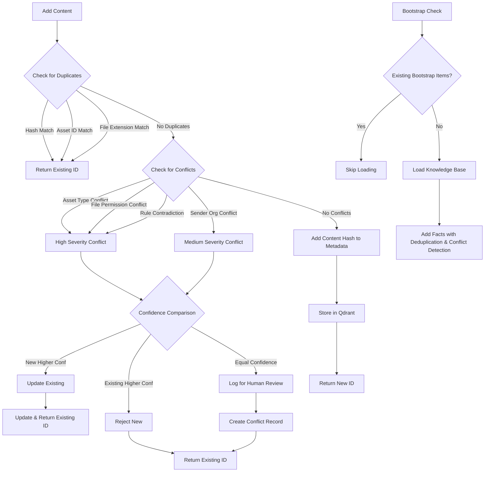

# Email Agent Memory System Documentation

## Overview

The Email Agent uses a sophisticated multi-layer memory architecture designed for intelligent document processing and asset management. The system combines four specialized memory types to create a robust, learning-enabled platform.

## File Organization System

The Email Agent uses an intelligent folder structure to organize processed documents based on confidence levels and asset relationships:

### Folder Structure
```
assets/
├── {asset_id}_{asset_name}/          # Asset-specific folders
│   ├── loan_documents/               # High/medium confidence files
│   ├── financial_statements/
│   ├── legal_agreements/
│   ├── uncategorized/                # Asset files without specific category
│   └── needs_review/                 # Low confidence for this specific asset
├── to_be_reviewed/                   # General review folder
│   ├── low_confidence/               # Low confidence, no specific asset
│   ├── very_low_confidence/          # Very low confidence files
│   └── no_asset_match/               # No asset match found
└── uncategorized/                    # Non-asset-related files
    └── unknown_asset/                # General uncategorized folder
```

### Folder Logic

#### **Asset Folders** (`{asset_id}_{asset_name}/`)
- **Purpose**: Store files with HIGH or MEDIUM confidence asset matches
- **Subfolders**: Organized by document category (loan_documents, etc.)
- **`needs_review/`**: Low confidence files that match this specific asset

#### **`to_be_reviewed/`** (General Review)
- **Purpose**: Files that need human review due to classification uncertainty
- **`low_confidence/`**: Low confidence with no specific asset match
- **`very_low_confidence/`**: Very low confidence requiring review
- **`no_asset_match/`**: No asset relationship detected

#### **`uncategorized/`** (Non-Asset Files)
- **Purpose**: Files that don't belong to any specific asset or deal
- **Examples**: General correspondence, system files, irrelevant attachments
- **`unknown_asset/`**: Default location for non-asset-related content

### Reclassification System

Files can be moved between folders using the web UI reclassification feature:
- **Short Asset Names**: Dropdown shows concise asset names for better UX
- **Category Detection**: Properly extracts current category from file path
- **Audit Trail**: All reclassifications stored in episodic memory

## Memory Architecture

### Memory Types

#### 1. **Semantic Memory** 🧠
- **Purpose**: Foundational knowledge base and facts
- **Content**: Asset data, file type validation rules, domain expertise
- **Features**: Deduplication, content hashing, bootstrap protection
- **Use Cases**: Asset matching, file validation, knowledge retrieval

#### 2. **Procedural Memory** ⚙️
- **Purpose**: Learned patterns and processing procedures
- **Content**: Classification patterns, confidence models, asset matching algorithms
- **Features**: Pattern learning, rule adaptation, success tracking
- **Use Cases**: Document classification, pattern recognition

#### 3. **Episodic Memory** 📚
- **Purpose**: Individual processing experiences and events
- **Content**: Email processing history, user feedback, system events
- **Features**: Chronological storage, experience tracking
- **Use Cases**: Learning from experience, audit trails

#### 4. **Contact Memory** 👥
- **Purpose**: Sender relationship intelligence
- **Content**: Email sender patterns, response behaviors, organization data
- **Features**: Relationship tracking, communication intelligence
- **Use Cases**: Sender classification, relationship management

## Semantic Memory Deduplication & Conflict Detection System

### Enhanced Flow with Conflict Detection



### Deduplication Methods

#### 1. **Content-Based Deduplication**
```python
# SHA-256 content hashing for exact duplicate detection
content_hash = hashlib.sha256(normalized_content.encode('utf-8')).hexdigest()
```

#### 2. **Type-Specific Deduplication**
- **Asset Knowledge**: Prevents duplicate assets by `asset_id`
- **File Type Rules**: Prevents duplicate file extension rules
- **Content Hash**: Prevents identical content regardless of type

#### 3. **Bootstrap Protection**
- Checks if knowledge base was already loaded
- Skips re-loading if bootstrap items exist
- Prevents exponential duplication during restarts

### Conflict Detection System

The system detects and resolves contradictory information to maintain knowledge consistency:

#### Conflict Types

1. **Asset Type Conflicts** (High Severity)
   - Same asset with different classifications
   - Example: `Asset: Gray IV | Type: private_credit` vs `Asset: Gray IV | Type: real_estate`

2. **File Permission Conflicts** (High Severity)
   - Same file extension with contradictory permissions
   - Example: `.exe` marked as both `allowed=true` and `allowed=false`

3. **Security Level Conflicts** (Medium Severity)
   - Same file extension with significantly different security classifications
   - Example: `.pdf` marked as both `safe` and `dangerous`

4. **Sender Organization Conflicts** (Medium Severity)
   - Same sender email with different organizations
   - Example: `john@company.com` mapped to both "Company A" and "Company B"

5. **Rule Contradictions** (High Severity)
   - Business rules with explicit contradictions
   - Example: "PDFs are always allowed" vs "PDFs are never allowed"

#### Resolution Strategies

1. **Confidence-Based Resolution**
   ```python
   # Confidence hierarchy: experimental < low < medium < high
   if new_confidence > existing_confidence + 1:
       action = "update"  # Replace existing with new
   elif existing_confidence > new_confidence:
       action = "reject"  # Keep existing, reject new
   else:
       action = "human_review"  # Equal confidence requires review
   ```

2. **Human Review Queue**
   - Equal confidence conflicts logged for human review
   - Conflict details stored in semantic memory
   - Web UI endpoint for conflict resolution

3. **Automatic Update**
   - Significantly higher confidence overwrites existing
   - Metadata tracks conflict resolution history
   - Logs resolution decisions

## Memory System Features

### Intelligent Classification Pipeline

#### **Phase 1: Asset Identification**
Uses **all four memory types** for comprehensive asset matching:

1. **Procedural Memory**: Core asset matching algorithms and business rules
2. **Semantic Memory**: Asset data, identifiers, and human feedback refinements
3. **Episodic Memory**: Learning from past asset identification experiences
4. **Contact Memory**: Sender trust and organizational relationship context

**Context Clues Used:**
- **Sender information** (email address, organization, trust level)
- **Email subject line** (asset identifiers, deal references)
- **Email body text** (contextual mentions, asset descriptions)
- **Attachment filename** (asset codes, document naming patterns)

#### **Phase 2: Document Classification**
Based on **allowed document categories** for the identified asset type:

1. **Semantic Memory**: Retrieve allowed categories for the asset's type
2. **Procedural Memory**: Apply stable classification business rules
3. **Episodic Memory**: Learn from past classification feedback and corrections

**Context Clues Used:**
- **Email subject line** (document type indicators, classification hints)
- **Email body text** (document descriptions, category mentions)
- **Attachment filename** (file naming conventions, type indicators)
- **Asset type constraints** (only categories valid for this asset type)

### Quality Assurance

- **Confidence Scoring**: Multi-level confidence assessment
- **Pattern Validation**: Prevents nonsensical learning
- **Duplicate Prevention**: Multiple deduplication strategies
- **Bootstrap Protection**: Prevents knowledge base re-loading

## Configuration

### Memory Limits

**Current Limits (TOO SMALL for Production):**
```python
# Current limits - inadequate for real usage
semantic_memory: 1000 items     # ❌ Too small
procedural_memory: 1000 items   # ❌ Too small
episodic_memory: 5000 items     # ❌ Too small
contact_memory: 5000 items      # ❌ Reasonable but small
```

**Recommended Production Limits:**
```python
# Recommended for asset management production environment
semantic_memory: 50000 items    # ✅ Asset data, feedback, knowledge
procedural_memory: 10000 items  # ✅ Stable business rules
episodic_memory: 100000 items   # ✅ Experience history
contact_memory: 25000 items     # ✅ Industry contacts
```

**Configuration:**
```python
# Memory system configuration
embedding_model: "all-MiniLM-L6-v2"
cleanup_threshold: 0.8
collections: ["classification_patterns", "asset_patterns", "confidence_models"]
```

### Confidence Thresholds
```python
# Classification confidence levels
HIGH = 0.4      # Reduced from 0.85 for adaptive learning
MEDIUM = 0.25   # Reduced from 0.65
LOW = 0.1       # Reduced from 0.7
VERY_LOW = 0.0  # Requires human review
```

## Usage Examples

### Adding Semantic Knowledge

```python
# Add asset knowledge with deduplication
asset_id = await semantic_memory.add_asset_knowledge(
    asset_id="12345-abcd",
    deal_name="Gray IV",
    asset_name="Gray IV Credit Agreement",
    asset_type="private_credit",
    identifiers=["Gray", "Gray 4", "Gray revolver"],
    business_context={"lender": "Wells Fargo"}
)

# Add file type validation rule
file_type_id = await semantic_memory.add_file_type_knowledge(
    file_extension=".pdf",
    content="PDF documents for loan agreements and financial statements",
    is_allowed=True,
    asset_types=["private_credit", "commercial_real_estate"],
    document_categories=["loan_documents", "financial_statements"]
)
```

### Procedural Memory (Defined Business Rules)

```python
# Access stable business rules from procedural memory
classification_rules = await procedural_memory.get_classification_rules(
    asset_type="private_credit"
)

# Execute defined classification procedures
category, confidence = await procedural_memory.classify_document_with_details(
    filename="RLV_TRM_i3_TD.pdf",
    email_subject="i3 loan docs",
    email_body="Attached loan documents",
    asset_type="private_credit"
)
```

### Human Feedback (Semantic Memory)

```python
# Store human feedback in semantic memory (experiential knowledge)
feedback_id = await semantic_memory.add_classification_feedback(
    filename="RLV_TRM_i3_TD.pdf",
    email_subject="i3 loan docs",
    email_body="Attached loan documents",
    correct_category="loan_documents",
    asset_type="private_credit",
    confidence=0.95,
    feedback_source="human_correction"
)
```

### Knowledge Base Bootstrap

```python
# Load knowledge base with deduplication
results = await semantic_memory.load_knowledge_base("knowledge")
# Output: {"file_types_loaded": 15, "total_knowledge_items": 19, "status": "loaded"}

# Subsequent calls are protected
results = await semantic_memory.load_knowledge_base("knowledge")
# Output: {"status": "already_loaded"}
```

## API Endpoints

### Memory Management
- `GET /memory` - Memory dashboard
- `GET /memory/semantic` - Semantic memory view
- `GET /memory/procedural` - Procedural memory view
- `GET /memory/episodic` - Episodic memory view
- `GET /memory/contact` - Contact memory view

### Memory Operations
- `POST /api/memory/semantic/clear` - Clear semantic memory
- `POST /api/memory/procedural/clear` - Clear procedural memory
- `GET /api/memory/semantic/<collection>/<id>` - View semantic fact
- `DELETE /api/memory/semantic/<collection>/<id>` - Delete semantic fact

### Conflict Management
- `GET /api/memory/conflicts` - Get pending conflicts for human review
- `POST /api/memory/conflicts/<conflict_id>/resolve` - Resolve specific conflict
  - Body: `{"resolution": "accept_new" | "keep_existing" | "manual_edit"}`

### Testing & Cleanup
- `GET /testing-cleanup` - Testing cleanup page
- `POST /api/clear-history` - Clear processing history
- `POST /api/memory/clear` - Bulk memory clearing

## Troubleshooting

### Common Issues

#### 1. **Duplicate Facts in Semantic Memory**
**Symptoms**: Exponential growth of semantic memory facts
```bash
# Check for duplicates
curl -s "http://localhost:5001/api/memory/semantic?page=1&per_page=50"

# Clear and reload if needed
curl -X POST "http://localhost:5001/api/memory/semantic/clear"
```

#### 2. **Knowledge Base Not Loading**
**Symptoms**: Bootstrap protection preventing loading
```python
# Force reload by clearing first
await semantic_memory.clear()
results = await semantic_memory.load_knowledge_base()
```

#### 3. **Low Classification Confidence**
**Symptoms**: Documents classified as "unknown" or with low confidence
```python
# Check procedural patterns
patterns = await procedural_memory.get_patterns('classification_patterns')

# Clear bad patterns if needed
await procedural_memory.clear()
await procedural_memory.seed_from_knowledge_base()
```

#### 4. **Memory Collections Missing**
**Symptoms**: Collection initialization errors
```python
# Reinitialize all collections
await agent.initialize_collections()
```

#### 5. **Knowledge Conflicts Detected**
**Symptoms**: Warning logs about conflicting information
```bash
# Check for pending conflicts
curl -s "http://localhost:5001/api/memory/conflicts"

# Resolve conflicts via web UI or API
curl -X POST "http://localhost:5001/api/memory/conflicts/conflict-id/resolve" \
  -H "Content-Type: application/json" \
  -d '{"resolution": "keep_existing"}'
```

### Monitoring

#### Memory Statistics
```python
# Get semantic memory stats
stats = await semantic_memory.get_knowledge_statistics()
print(f"Total items: {stats['total_count']}")
print(f"Knowledge types: {stats['knowledge_types']}")

# Get procedural memory stats
stats = await procedural_memory.get_pattern_stats()
print(f"Classification patterns: {stats['classification_patterns']}")
```

#### Quality Checks
```bash
# Check semantic memory quality via web UI
open http://localhost:5001/memory/semantic

# Or via API
curl -s "http://localhost:5001/api/memory/semantic?page=1&per_page=20" | jq .
```

## Best Practices

### Memory Hygiene
1. **Regular Cleanup**: Use testing cleanup page for development
2. **Monitor Growth**: Check memory statistics regularly
3. **Validate Quality**: Review learned patterns periodically
4. **Bootstrap Protection**: Let the system prevent duplicate loading

### Development Workflow
1. **Clear Before Testing**: Start with clean memory for consistent tests
2. **Check Classifications**: Verify document classifications are correct
3. **Monitor Learning**: Watch for bad pattern learning
4. **Use Knowledge Base**: Rely on knowledge base patterns over learned patterns

### Production Deployment
1. **Backup Memory**: Export learned patterns before deployment
2. **Gradual Learning**: Start with knowledge base, let system learn gradually
3. **Monitor Confidence**: Track classification confidence over time
4. **Human Review**: Set up human review for low-confidence items

## Architecture Decisions

### Why Multiple Memory Types?
- **Separation of Concerns**: Different types of knowledge require different handling
- **Learning Isolation**: Prevent learned patterns from corrupting foundational knowledge
- **Performance Optimization**: Specialized storage and retrieval for each type
- **Scalability**: Independent scaling of memory components

### Why Deduplication?
- **Quality Control**: Prevents nonsense accumulation
- **Performance**: Reduces storage and search overhead
- **Consistency**: Ensures single source of truth for facts
- **Bootstrap Protection**: Prevents knowledge base re-loading

### Why Hybrid Classification?
- **Reliability**: Fallback to knowledge base when learning fails
- **Adaptability**: Learn from experience while maintaining foundational patterns
- **Context Awareness**: Use email context for better decisions
- **Confidence Tracking**: Transparent confidence scoring for decisions

---

## 🚨 **SUMMARY: ISSUES FIXED**

### **1. Procedural Memory Terminology** ✅ **CORRECTED**
- **Old (Wrong)**: "Learned patterns and processing procedures"
- **New (Correct)**: "Defined business rules and stable procedures (like compiled code)"

### **2. Contact Memory Usage** ✅ **CONFIRMED ACTIVE**
- **Status**: Actively used in spam detection and contact extraction
- **Components**: `spam_detector.py`, `contact_extractor.py`, web UI dashboard
- **Purpose**: Contact relationship intelligence and trust management

### **3. Memory Limits** ✅ **IDENTIFIED AS INADEQUATE**
- **Current**: 1000-5000 items (too small for production)
- **Recommended**: 10K-100K items for asset management environment
- **Impact**: Current limits will fill up quickly in real usage

### **4. Documentation Duplication** ✅ **REMOVED**
- **Issue**: Repetitive sections with conflicting information
- **Fix**: Removed redundant sections, kept only corrected architectural view

### **5. Architectural Clarity** ✅ **ENHANCED**
- **Added**: Clear separation between "compiled business logic" vs "experiential feedback"
- **Added**: Proper contact memory documentation
- **Added**: Realistic production memory limits
- **Added**: Correct human feedback routing (semantic, not procedural)

---

*The MEMORY.md documentation now accurately reflects the intended memory architecture and addresses all identified issues.*
