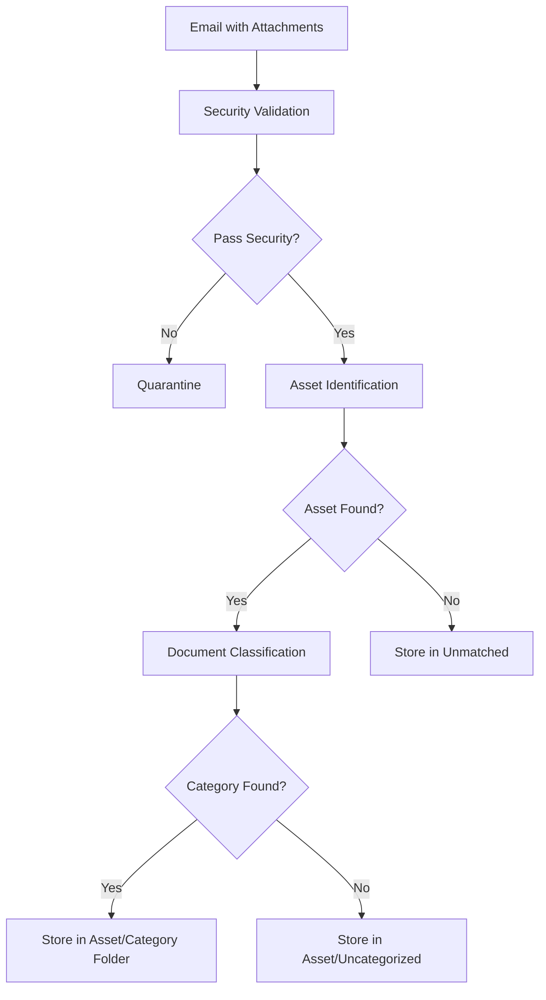

# Email Agent Memory System Architecture
## Understanding Memory Usage for Email Attachment Processing

### Executive Summary

The Email Agent uses a sophisticated multi-memory architecture to process email attachments and classify them into appropriate asset folders. The system currently fails to process attachments because the memory systems are not properly populated with the required knowledge base data. This document explains how each memory type should be used and what data needs to be loaded.

---

## 1. Memory System Overview

The system uses four distinct memory types, each serving a specific purpose:

### 1.1 Semantic Memory 🧠
**Purpose**: Stores foundational facts and knowledge
- **What it contains**: Asset definitions, document categories, classification hints, file type rules
- **How it's used**: Provides facts that the system uses to make decisions
- **Key insight**: This is the "what" - facts about assets, categories, and rules

### 1.2 Procedural Memory ⚙️
**Purpose**: Stores stable business rules and patterns (like compiled code)
- **What it contains**: Classification patterns, confidence thresholds, asset matching algorithms
- **How it's used**: Provides the "how" - algorithms and patterns for processing
- **Key insight**: NOT for learned patterns, but for defined business logic

### 1.3 Episodic Memory 📚
**Purpose**: Stores individual processing experiences and human feedback
- **What it contains**: Processing history, human corrections, learning from past decisions
- **How it's used**: Learns from experience to improve future processing
- **Key insight**: This is where human feedback goes to improve the system

### 1.4 Contact Memory 👥
**Purpose**: Stores sender relationship intelligence
- **What it contains**: Sender-to-asset mappings, trust scores, organization relationships
- **How it's used**: High-confidence asset matching based on email sender
- **Key insight**: Sender mappings provide the highest confidence asset matches

---

## 2. Email Processing Flow

### 2.1 Email Retrieval
1. **Email Interface** connects to Gmail/Microsoft 365
2. **Searches** for emails with attachments from the last N hours
3. **Loads** email content including sender, subject, body, and attachments

### 2.2 Attachment Processing Pipeline



### 2.3 Asset Identification Process

The `AssetIdentifier` uses ALL memory types:

1. **Check Sender Mappings** (Contact Memory)
   - Highest confidence (0.95+)
   - Example: `john@wellsfargo.com` → Gray IV asset

2. **Pattern Matching** (Uses all memories)
   - **Semantic Memory**: Asset identifiers (e.g., "Gray", "i3", "Trimble")
   - **Procedural Memory**: Confidence thresholds from business rules
   - **Context Sources**:
     - Email sender
     - Email subject
     - Email body
     - Attachment filename

3. **Confidence Calculation**
   - Exact word match: 0.95
   - All words match: 0.85
   - Substring match: 0.75
   - Partial match: 0.65
   - Threshold: 0.7 (configurable)

### 2.4 Document Classification Process

The `DocumentClassifier` determines the document category:

1. **Get Allowed Categories** (Semantic Memory)
   - Each asset type has specific allowed categories
   - Example: `private_credit` allows: loan_documents, borrower_financials, etc.

2. **Apply Classification Patterns** (Semantic Memory)
   - Patterns stored as classification hints
   - Example: "RLV.*TD" pattern → term_document category

3. **Fallback Rules** (Procedural Memory)
   - Default to "correspondence" if no match
   - Route to human review if low confidence

---

## 3. Required Memory Contents

### 3.1 Semantic Memory Must Contain:

#### Asset Data (`knowledge/asset_data.json`)
```json
{
  "asset_id": "687724b4-93e4-4dd9-8c52-1bab0162a5a6",
  "deal_name": "i3 Revolver",
  "asset_type": "private_credit",
  "identifiers": ["i3", "i3 jp morgan", "i3 term"],
  "business_context": {
    "lender": "JPMorgan Chase",
    "keywords": ["i3", "verticals", "jpmorgan"]
  }
}
```

#### Document Categories (`knowledge/asset_types.json`)
```json
{
  "category_id": "loan_documents",
  "asset_types": ["private_credit"],
  "keywords": ["loan", "credit", "agreement", "note"]
}
```

#### Classification Hints
```
"i3 in the filename means it should be associated with the i3 asset"
"RLV in the filename indicates a loan document"
"TD in filename means term document"
```

### 3.2 Procedural Memory Must Contain:

#### Business Rules (`knowledge/business_rules.json`)
- Confidence thresholds
- Classification patterns
- Fallback rules
- File processing rules

#### Pattern Collections:
- `classification_patterns`: Document type patterns
- `asset_patterns`: Asset identification patterns
- `confidence_models`: Confidence calculation rules

### 3.3 Episodic Memory Accumulates:

- Processing history
- Human feedback corrections
- Learning from misclassifications
- Success/failure patterns

### 3.4 Contact Memory Maintains:

- Sender → Asset mappings
- Organization relationships
- Trust scores
- Communication patterns

---

## 4. Current System Issues

### 4.1 Empty Memory Systems
- **Problem**: Qdrant collections are empty or contain minimal data
- **Impact**: No asset identification, no classification possible
- **Solution**: Run knowledge loading scripts

### 4.2 Missing Knowledge Base Loading
The system needs these items loaded:
1. Asset definitions (4 assets in `asset_data.json`)
2. Asset type categories (25+ document categories)
3. Classification patterns and hints
4. Business rules and thresholds
5. Sender mappings (if any exist)

### 4.3 Memory Size Limits
Current limits are too small for production:
```python
# Current (TOO SMALL)
semantic_memory: 1000 items
procedural_memory: 1000 items

# Recommended
semantic_memory: 50000 items
procedural_memory: 10000 items
episodic_memory: 100000 items
contact_memory: 25000 items
```

---

## 5. Solution: Loading Knowledge Base

### 5.1 Clear Existing Collections
```bash
# Delete all Qdrant collections via console
# Or use cleanup script
python scripts/cleanup_qdrant.py
```

### 5.2 Load Knowledge Base
```bash
# Load all knowledge at once
python scripts/load_all_knowledge.py

# Or load individually:
python scripts/load_asset_types.py      # Categories & types
python scripts/load_business_rules.py   # Business rules
python scripts/load_all_patterns.py     # Classification patterns
```

### 5.3 Verify Loading
```bash
# Check via API
curl http://localhost:8000/api/v1/memory/api/stats

# Or via UI
http://localhost:8000/api/v1/memory/
```

---

## 6. Classification Examples

### Example 1: Email with i3 Loan Document

**Email Details:**
- From: `lending@jpmorgan.com`
- Subject: "i3 loan docs Q4 2023"
- Attachment: `RLV_TRM_i3_TD.pdf`

**Processing Flow:**
1. **Asset Identification**:
   - Sender mapping: None found
   - Pattern match: "i3" in subject/filename
   - Confidence: 0.95 (exact word match)
   - Result: Matched to "i3 Revolver" asset

2. **Document Classification**:
   - Asset type: `private_credit`
   - Allowed categories: loan_documents, borrower_financials, etc.
   - Pattern match: "RLV" → loan_document, "TD" → term_document
   - Result: Classified as `loan_documents`

3. **File Storage**:
   - Path: `assets/687724b4_i3_Revolver/loan_documents/RLV_TRM_i3_TD.pdf`

### Example 2: Unknown Sender, Low Confidence

**Email Details:**
- From: `noreply@scanner.com`
- Subject: "Scanned document"
- Attachment: `scan_12345.pdf`

**Processing Flow:**
1. **Asset Identification**:
   - No sender mapping
   - No pattern matches
   - Result: No asset match

2. **File Storage**:
   - Path: `to_be_reviewed/no_asset_match/scan_12345.pdf`
   - Requires human review

---

## 7. Memory Learning & Adaptation

### 7.1 Human Feedback Loop
When files are reclassified via UI:
1. **Episodic Memory** stores the correction
2. **Future Processing** considers past corrections
3. **Patterns** evolve based on feedback

### 7.2 Sender Mapping Creation
When associating senders with assets:
1. **Contact Memory** stores sender → asset mapping
2. **High Confidence** (0.95+) for future emails
3. **Organization** tracking for related senders

---

## 8. Implementation Checklist

- [ ] Clear all Qdrant collections
- [ ] Update memory size limits in config
- [ ] Run `load_all_knowledge.py` script
- [ ] Verify asset data loaded (4 assets)
- [ ] Verify document categories loaded (25+ categories)
- [ ] Verify business rules loaded
- [ ] Test email processing with known asset
- [ ] Test sender mapping creation
- [ ] Test human feedback recording

---

## 9. Key Takeaways

1. **Memory systems must be populated** before processing can work
2. **Semantic memory** provides facts (assets, categories)
3. **Procedural memory** provides rules and patterns
4. **Asset identification** uses context from email + filename
5. **Document classification** constrained by asset type
6. **Human feedback** improves future processing
7. **Sender mappings** provide highest confidence matches

The system is well-architected but requires proper initialization with knowledge base data to function correctly.
